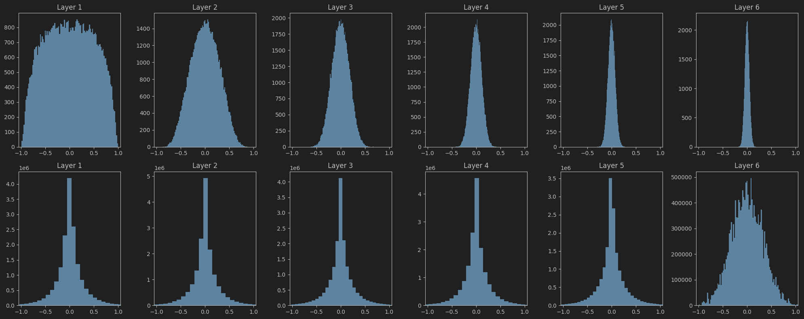
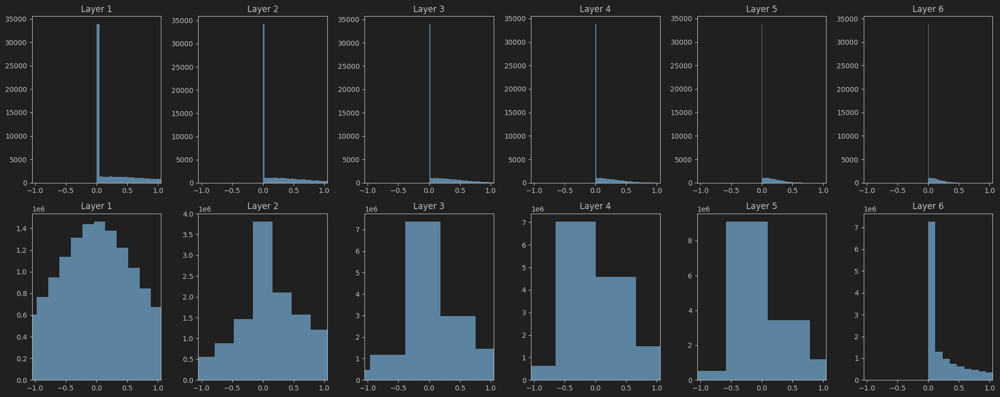

# Weight Initializers

## Summary

| Initialization  | Recommended For     |       Preserves Variance        | Activation Function |
|:---------------:|---------------------|:-------------------------------:|---------------------|
|     `Zero`      | bias                |                                 | -                   |
|    `Random`     | Small NN            |  :material-close: {.red-cross}  | All                 |
|    `Xavier`     | Shallow / Mid-depth | :material-check: {.green-check} | Tanh, Sigmoid       |
|    `Kaiming`    | Deep NN             | :material-check: {.green-check} | ReLU, Leaky ReLU    |

Behaviour of diferent initializers with respect to the variance of activations and gradients can be seen [here](https://github.com/saikrishnaponnam/Machine-Learning/blob/main/notebooks/initializers.ipynb)

## Constant Initialization

Weights of a layer are initialized to a fixed constant value. 
Initializing all weights in a layer to a fixed constant value is not recommended. 
When this happens, each neuron in the layer receives the same gradient during backpropagation, causing them to learn identical features. 
This leads to redundancy, as the neurons fail to capture diverse representations. 
Consequently, the model’s ability to learn complex patterns is significantly reduced.

$$ \mathbf{W}_{ij} = c \quad \forall ~ i,j $$

## Random Initialization
Weights of a layer are initialized to random values. 
Unlike constant initialization, this randomness enables each neuron to learn distinct features.
The weights are usually drawn from a uniform or normal distribution, such as:
$$ \mathbf{W}_{ij} \sim \mathcal{N}(\mu, \sigma^2) $$
While this approach works reasonably well for shallow networks, it can lead to issues like vanishing or exploding gradients in deeper architectures.
This occurs because the variance of activations and gradients may increase or decrease exponentially with the number of layers, primarily due to not accounting for the number of input and output neurons in the initialization scheme.

## Xavier (Glorot) Initialization
[Paper](http://proceedings.mlr.press/v9/glorot10a/glorot10a.pdf)  
Xavier initialization aims to keep the variance of the activations and gradients constant across layers.  

**Why Is It Needed?**  
If weights are not initialized properly: 

- Too small: Activations and gradients shrink ⇒ vanishing gradients 
- Too large: Activations and gradients blow up ⇒ exploding gradients  

Xavier initialization solves this by scaling weights based on the number of input and output units in the layer.
It assumes the activation functions are linear, sigmoid, or tanh.  
Let:

- $n_{in}$ : number of input units to a layer
- $n_{out}$ : number of output units from a layer

$$ W \sim \mathcal{N}(0, \frac{2}{n_{in} + n_{out}}) $$

**Goal of Xavier Initialization**  
Assume weights $w_i$ and $x_i$ are independent and identically distributed (i.i.d.) random variables.  

[//]: # (Then, the variance of the activations and gradients can be expressed as:)

[//]: # ( - $\mathbb{E}[x_i] =0, Var&#40;x_i&#41; = \sigma_x^2$)
[//]: # ( - $\mathbb{E}[W_{i}] = 0, Var&#40;W_{i}&#41; = \sigma_w^2$)
[//]: # ( - $z = \sum_{i} W_{i} x_i$)

We want to keep the variance of the activations and gradients constant across layers. So:
$$  \text{Var}(a^l) \approx  \text{Var}(a^{l+1}) $$
$$ \text{Var}(\delta^{l}) \approx \text{Var}(\delta^{l+1}) $$
Tanh is linear around zero => tanh(z) = z when z is small.

$$\begin{align*}
 Var(a^{l+1}) &= Var(z^{l+1}) \\
 & = Var(\sum_{i=1}^{n_l} w_i^{l+1}a_i^l ) \\
 &= \sum_{i=1}^{n_l} Var(w_i^{l+1}a_i^l )  \\
 &= \sum_{i=1}^{n_l} Var(w_i^{l+1}) Var(a_i^l) \\ 
 &= n_{l} . Var(w_i^{l+1}) Var(a^l) \\
 Var(W) &= \frac{1}{n_l}  
\end{align*}$$  

Similarly for gradient $Var(W) = \frac{1}{n_{l+1}}$

To balance the variance of the activations and gradients, we set: $ Var(W) = \frac{2}{n_{in} + n_{out}} $

## Kaiming (He) Initialization

[Paper](https://arxiv.org/abs/1502.01852)  
**Why Is It Needed?**  
Xavier initialization assumes that the activation function is either linear, sigmoid, or tanh. However, ReLU is not linear(near origin).
ReLU zeros out all negative values. On average, ReLU passes only about half of its inputs forward, effectively reducing the output variance by approximately 50%. 
This reduction in variance can cause activations to shrink across layers, potentially leading to stalled training. 
In such cases, Xavier initialization underestimates the necessary variance.

Kaiming initialization is designed specifically for ReLU-like activations.

$$ W \sim \mathcal{N}(0, \frac{2}{n_{in}}) $$
The factor 2 compensates for the ReLU “drop” of half the activations

**Goal of Xavier Initialization**  
We want to keep the variance of the forward activations constant across layers. So:
$$  \text{Var}(a^l) \approx  \text{Var}(a^{l-1}) $$

$$ \begin{align*}
Var(z^{l}) &= Var(\sum_{i=1}^{n_{in}} w_i^{l}a_i^{l-1} ) \\
& = \sum_{i=1}^{n_{in}} Var(w_i^{l}a_i^{l-1})  \\
&= n_{in}  Var(w_i^{l}a_i^{l-1})  \\
&= n_{in}(Var(w_i^{l}) Var(a_i^{l-1}) + \mathbb{E}[w_i^l]^2Var(a_i^{l-1}) + \mathbb{E}[a_i^{l-1}]^2 Var(w_i^l))\\
&= n_{in} (Var(w_i^l) (Var(a_i)^{l-1} + E[a_i^{l-1}]^2)) \\
&= n_{in} (Var(w_i^l) \mathbb{E}[(a_i^{l-1})^2])
\end{align*}$$

$$ \begin{align*}
\mathbb{E}[(z_i^{l-1})^2]) &= \int_{-\infty}^{\infty} (a_i^{l-1})^2 P_a(a_i^{l-1}) da_i^{l-1} \\
&= \int_{-\infty}^{\infty} max(0, z_i^{l-1})^2 P_a(z_i^{l-1}) dz_i^{l-1} \\
&= \int_{0}^{\infty} (z_i^{l-1})^2 P_z(z_i^{l-1}) dz_i^{l-1}  \\
&= \frac{1}{2} \int_{-\infty}^{\infty} (z_i^{l-1})^2 P_z(z_i^{l-1}) dz_i^{l-1} \\
&= \frac{1}{2} Var(z_i^{l-1})\\
\end{align*}$$

$$ Var(W) = \frac{2}{n_{in}} $$

Empirically, the backward gradients will also behave reasonably as long as the forward activations are well-scaled. So unlike xavier we only try to maintain variance of activations.

<!--## Orthogonal initialization -->

## Q&A

1. Why is weight initialization important in neural networks?
    - Weight initialization is important because it can significantly affect the convergence speed and performance of the model. Proper initialization helps to maintain a good flow of gradients during training, preventing issues like vanishing or exploding gradients.

- Can biases be initialized to zero? Why or why not?
    - Yes, biases can be initialized to zero. Unlike weights, initializing biases to zero does not cause symmetry issues because biases are added to the output of neurons and do not affect the learning of different features. In fact, initializing biases to zero is a common practice.

- How does weight initialization affect vanishing or exploding gradients?
    - Weight initialization affects vanishing or exploding gradients by influencing the scale of the activations and gradients as they propagate through the layers. If weights are initialized too small, the gradients can vanish, leading to slow convergence. If weights are initialized too large, the gradients can explode, causing instability during training.

- Diagnose an issue in training that could be due to bad initialization.
    - If the model is not learning at all or learning very slowly, it could be due to bad initialization. 
      Visualizing the gradients during training can help identify this issue.

- If your deep model is not learning, what role might initialization play and how would you investigate it?
    - If a deep model isn’t learning, I would suspect initialization if:
        - The loss remains constant or decreases very slowly. 
        - Activations or gradients vanish or explode. 
        - All neurons appear to behave identically (symmetry).
    - Visualizing gradients and activations across layers.