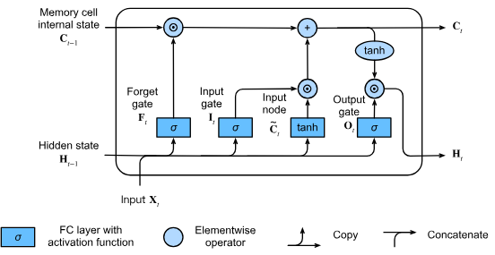

# LSTM

The vanilla RNNs suffer from vanishing and exploding gradients, which makes them difficult to train on long sequences. 
LSTM (Long Short-Term Memory) networks were introduced to address these issues by introducing a more complex architecture that can learn long-term dependencies.

## Architecture
At each time step $t$, an LSTM unit processes the current input $x_t$, the previous hidden state $h_{t−1}$, and the previous cell state $C_{t-1}$ to produce a new hidden state $h_t$ and cell state $C_t$.  
LSTMs use a cell state to store long-term dependencies and gates to regulate information flow.
Each LSTM unit or cell has three main gates and two states:

1.**Forget Gate**: Decides what information to discard from the cell state.

$$f_t = \sigma(W_{xf} x_t + W_{hf} h_{t-1} + b_{f})$$

2.**Input Gate**: Decides what new information to add to the cell state.

$$i_t = \sigma(W_{xi} x_t + W_{hi} h_{t-1} + b_{i}) \\ \tilde{C}_t = tanh(W_{xC} x_t + W_{hC} h_{t-1} + b_C) $$

3.**Output Gate**: Decides what information to output based on the cell state.

$$o_t = \sigma(W_{xo} x_t + W_{ho} h_{t-1} + b_o)$$

4.**Cell State**: The memory of the LSTM that carries long-term information.

$$C_t = f_t * C_{t-1} + i_t * \tilde{C}_t$$
    
5.**Hidden State**: The output of the LSTM cell at the current time step.

$$h_t = o_t * \tanh(C_t)$$

<figure markdown="span">
    
</figure>

## Training
The goal is to minimize a loss function (e.g., cross-entropy, MSE) by updating the weights of the LSTM using gradient descent and backpropagation through time (BPTT).
BPTT is similar to RNNs but accounts for the cell state and gates in LSTMs.

## Backward Pass
Input: $d\_out = \frac{dL}{dh_t}$ from the next layer or loss function.

**Gradients w.r.t $W_{xf}$:**

$$\begin{align*}
\frac{\partial L}{\partial W_{xf}} &= \frac{\partial L}{\partial f_t} \cdot \frac{\partial f_t}{\partial W_{xf}} \\
&= \frac{\partial L}{\partial C_t} \cdot \frac{\partial C_t}{\partial f_t} \cdot \frac{\partial f_t}{\partial a_f} \frac{\partial a_f}{\partial W_{xf}} \\
&= \frac{\partial L}{\partial C_t} \cdot C_{t-1} \cdot f_t (1 - f_t) \cdot (x_t)^T 
\end{align*}$$

$\frac{\partial L}{\partial C_t}$, this gradient arise from 2 sources:  
1. Direct influence on output $h_t$.  
2. Backpropagated from next timestep, due to $C_{t+1}$ depends on $C_t$ via the forget gate.

$$\begin{align*}
\frac{\partial L}{\partial C_t} &= \frac{\partial L}{\partial h_t} \frac{\partial h_t}{\partial C_t} + \frac{\partial L}{\partial C_{t+1}} \frac{\partial C_{t+1}}{\partial C_t}  \\
&= \frac{\partial L}{\partial h_t} \cdot o_t \cdot (1 - \tanh^2(C_t)) + \frac{\partial L}{\partial C_{t+1}} \cdot f_{t+1}
\end{align*}$$

Gradients w.r.t $W_{xi}, W_{hf}, W_{hi}$ can be derived similarly.

**Gradients w.r.t $W_{xo}$:**

$$\begin{align*}
\frac{\partial L}{\partial W_{xo}} &= \frac{\partial L}{\partial o_t} \cdot \frac{\partial o_t}{\partial W_{xo}} \\
&= \frac{\partial L}{\partial h_t} \cdot \frac{\partial h_t}{\partial o_t} \cdot \frac{\partial o_t}{\partial a_o} \frac{\partial a_o}{\partial W_{xo}} \\
&= \frac{\partial L}{\partial h_t} \cdot \tanh(C_t) \cdot o_t (1 - o_t) \cdot (x_t)^T
\end{align*}$$

Gradients w.r.t $W_{ho}$ can be derived similarly.

**Gradients w.r.t $W_{xC}$**

$$\begin{align*}
\frac{\partial L}{\partial W_{xC}} &= \frac{\partial L}{\partial \tilde{C}_t} \cdot \frac{\partial \tilde{C}_t}{\partial W_{xC}} \\
&= \frac{\partial L}{\partial C_t} \cdot \frac{\partial C_t}{\partial \tilde{C}_t} \frac{\partial \tilde{C}_t}{\partial W_{xc}} \\
&= \frac{\partial L}{\partial C_t} \cdot i_t \cdot (1 - \tilde{C}_t^2) \cdot (x_t)^T 
\end{align*}$$

Gradients w.r.t $W_{hC}$ can be derived similarly.

**Gradients w.r.t input ($x_t ~\&~ h_{t-1}$)**

$$\begin{align*}
\frac{\partial L}{\partial x_t} &= \frac{\partial L}{\partial f_t} \cdot \frac{\partial f_t}{\partial x_t} + \frac{\partial L}{\partial i_t} \cdot \frac{\partial i_t}{\partial x_t} + \frac{\partial L}{\partial o_t} \cdot \frac{\partial o_t}{\partial x_t} + \frac{\partial L}{\partial \tilde{C}_t} \cdot \frac{\partial \tilde{C}_t}{\partial x_t} \\
&= \frac{\partial L}{\partial f_t} \cdot f_t (1 - f_t) \cdot W_{xf} + \frac{\partial L}{\partial i_t} \cdot i_t (1 - i_t) \cdot W_{xi} + \frac{\partial L}{\partial o_t} \cdot o_t (1 - o_t) \cdot W_{xo} + \frac{\partial L}{\partial \tilde{C}_t} \cdot (1 - \tilde{C}_t^2) \cdot W_{xC}
\end{align*}$$

$dx_t$ is required if we are also training the layers before the LSTM layer, such as an embedding layer or a convolutional layer.

$$\begin{align*}
\frac{\partial L}{\partial h_{t-1}} &= \frac{\partial L}{\partial f_t} \cdot \frac{\partial f_t}{\partial h_{t-1}} + \frac{\partial L}{\partial i_t} \cdot \frac{\partial i_t}{\partial h_{t-1}} + \frac{\partial L}{\partial o_t} \cdot \frac{\partial o_t}{\partial h_{t-1}} + \frac{\partial L}{\partial \tilde{C}_t} \cdot \frac{\partial \tilde{C}_t}{\partial h_{t-1}} \\
&= \frac{\partial L}{\partial f_t} \cdot f_t (1 - f_t) \cdot W_{hf} + \frac{\partial L}{\partial i_t} \cdot i_t (1 - i_t) \cdot W_{hi} + \frac{\partial L}{\partial o_t} \cdot o_t (1 - o_t) \cdot W_{ho} + \frac{\partial L}{\partial C_t} \cdot (1 - \tilde{C}_t^2) \cdot W_{hC}
\end{align*}$$

$dh_{t-1}$ is sent back to the previous time step.

## Practical Tips
