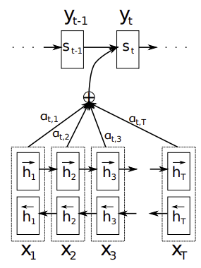
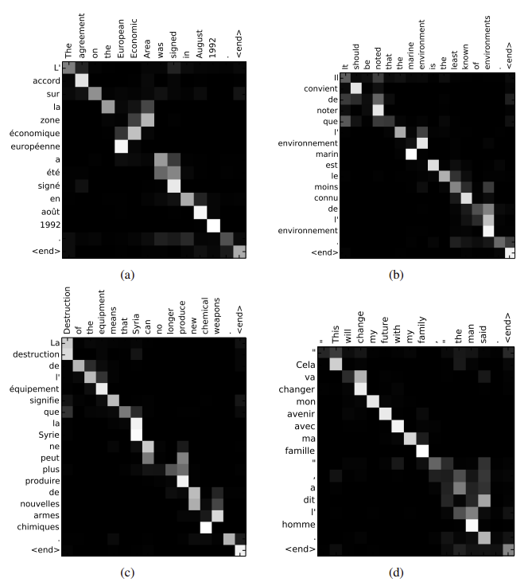

# Additive Attention

**Paper:** [Neural Machine Translation by Jointly Learning to Align and Translate](https://arxiv.org/abs/1409.0473) (ICLR 2015)

## Introduction

Traditional phrase-based translation systems consist of many separate components, each tuned individually. In contrast, neural machine translation (NMT) aims to build and train a single, large neural network that can generate accurate translations from input sentences.

Encoder-decoder architectures are widely used in NMT. In earlier approaches (such as [Seq2Seq](seq2seq.md) by Cho et al.), the encoder compresses the entire input sentence into a fixed-length vector, and the decoder generates the output sentence from this vector. However, this method struggles with long sentences, as it is difficult for a neural network to encode all the necessary information into a single vector. Cho et al. demonstrated that the performance of basic encoder-decoder models degrades as input sentence length increases.

To overcome this limitation, the authors propose an extension to the encoder-decoder model that jointly learns to align (using attention) and translate. When generating each word, the model searches for the most relevant parts of the input sentence, focusing on positions where important information is concentrated. The model then predicts the next target word based on a context vector derived from these positions and the previously generated target words.

The key advantage of this approach is that the model does not need to encode the entire input sentence into a single vector. Instead, it represents the input as a sequence of vectors and adaptively selects relevant subsets during decoding.

## Background

From a probabilistic perspective, translation involves finding a target sentence $y$ that maximizes the conditional probability $p(y|x)$ given an input sentence $x$. NMT models are trained to maximize this probability using parallel corpora, and have demonstrated strong performance compared to traditional methods

In the encoder-decoder framework, the encoder processes an input sentence, represented as a sequence of vectors $\mathbf{x} = (x_1, \cdots, x_{T_x})$, and compresses it into a single vector $c$. When using an RNN as the encoder, this process is described by:

$$ h_t = f(x_t, h_{t-1}) \text{ and } c = q(\{h_1, \cdots, h_{T_x}\}) $$

In the case of Seq2Seq, $f$ is an LSTM unit and $q$ is simply $h_T$. The decoder then defines a probability distribution over the possible translations $y$ by breaking down the joint probability into a series of conditional probabilities:

$$p(y) = \prod_{t=1}^T p(y_t| \{y_1, \cdots, y_{t-1}\}, c)$$

When using an RNN decoder, each conditional probability is computed as:

$$
p(y_t| \{y_1, \cdots, y_{t-1}\}, c) = g(y_{t-1}, s_t, c) \qquad (1)
$$

where $g$ is a nonlinear function (typically multi-layer), and $s_t$ represents the hidden state at time $t$.

## Architecture

<figure markdown="span">
    
</figure>

### Decoder

In the new model the conditional probability is defined as:

$$ p(y_i| \{y_1, \cdots, y_{i-1}\}, \mathbf{x}) = g(y_{i-1}, s_i, c_i) $$

Unlike the previous encode-decoder models, here the probability is conditioned on the different context vector $c_i$ for each target word $y_i$. The context vector is computed as a weighted sum of the encoder hidden states. Each $h_i$ contains information about the entire input sentence, with a strong focus on the surrounding parts.

$$c_i = \sum_{j=1}^{T_x} \alpha_{ij} h_j $$

The weight $\alpha_{ij}$ is computed using a softmax function over the attention scores $e_{ij}$:

$$\alpha_{ij} = \frac{\exp(e_{ij})}{\sum_{k=1}^{T_x} \exp(e_{ik})}$$

where $e_{ij}=a(s_{i-1}, h_j)$ is an alignment model which scores how well the inputs around position $j$ and output at position $i$ match.

The alignment model is typically a feed-forward neural network that takes the previous decoder state $s_{i-1}$ and the encoder hidden state $h_j$ as inputs. The alignment is not a latent variable, but directly computes a soft alignment which allows the gradient to be backpropagated. This gradient can be used to train the alignment model and the encoder-decoder jointly.

The probability $\alpha_{ij}$, or energy $e_{ij}$, reflects the importance of annotation $h_j$ with respect to the previous hidden state $s_{i-1}$ in deciding the next state $s_i$ and generating $y_i$. This attention mechanism allows the decoder to focus on different parts of the input sequence at each step, rather than relying on a single fixed context. As a result, the encoder is no longer required to compress all information into one vector, and the decoder can dynamically attend to the most relevant input positions when generating each word.

### Encoder

In this model the encoder processes not just the preceding words but also the following words. This is done by using a bidirectional RNN, which allows the model to capture context from both directions. 

A BiRNN consists of forward and backward RNN's. The forward RNN reads input as it is ordered, while the backward RNN reads it in reverse order. The hidden states from both RNNs are concatenated to form the final representation, $h_j$, of each input word.

## Training

The model is trained to maximize the conditional log-likelihood of the correct translation given the source sentence. Specifically, the objective is to maximize the sum of the log probabilities of the correct target words, conditioned on the source sentence and the previously generated target words. The model is trained using SGD together with Adadelta. Each SGD update is computed using a mini-batch of 80 sentences, and the model is trained for 5 days.

## Experiments

The authors evaluated their model on the English-to-French translation task using the WMT’14 dataset. The dataset contains a total of 850M words, which is reduced to 384M words using data selection. After tokenization vocabulary is restricted to 30,000 most frequent words in each language, with rare words replaced by an [unk] token.

The proposed model was compared against a baseline encoder-decoder model without attention (from Cho et al.), as well as traditional phrase-based statistical machine translation (SMT) systems. Performance was measured using BLEU scores on standard test sets: newstest2012 and newstest2013 for validation, newstest2014 for testing.

## Results

The attention-based model outperformed the baseline encoder-decoder model, achieving higher BLEU scores. The performance is on par with the phrase-base systems, when only sentences with known words are considered. This approach performs better than the baseline model, even for longer sentences. The baseline model's performance degrades significantly as the length of the input sentence increases, while the attention-based model maintains a more consistent performance across different sentence lengths.

Visualizations of the attention weights showed that the model learned meaningful alignments between source and target words, often corresponding to human-annotated alignments. 

<figure markdown="span">
    
    <figcaption>Alignment Visulization</figcaption>
</figure>