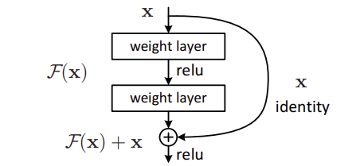

# ResNet: Deep Residual Learning for Image Recognition
[Paper](https://arxiv.org/abs/1512.03385) | [Original Code](https://github.com/KaimingHe/deep-residual-networks)

## Introduction

Deep Convolutional Neural Networks have driven significant advances in image classification. Increasing the depth of these networks has generally led to better performance. However, as networks become deeper degradation problem is observed, the accuracy saturates and then degrades rapidly. But this is not due to overfitting, since even the training error increases with depth.

This degradation suggests that deeper networks are harder to optimize, even though, in theory, a deeper model should perform at least as well as a shallower one by simply copying the shallow model and adding identity layers. The fact that deeper models perform worse indicates an optimization challenge.

ResNet addresses this issue through **residual learning**. Instead of having stacked layers learn the desired mapping $\mathcal{H}(x)$ directly, ResNet has them learn the residual mapping $\mathcal{F}(x) = \mathcal{H}(x) - x$. The intuition is that it is easier to optimize the residual function than the original mapping. If the optimal function is the identity, it is easier for the network to push the residuals to zero than to learn the identity mapping from scratch.

---

## Methodology

### Residual Learning

Let $\mathcal{H}(x)$ be the function a stack of layers aims to learn. If multiple nonlinear layers can approximate $\mathcal{H}(x)$, they should also be able to approximate the residual function $\mathcal{F}(x) = \mathcal{H}(x) - x$.

The reformulation is motivated by the phenomena about degradation problem. A depper model should have training error no grater than a shallower model, as the added layers can be constructed as identity mappings. But the degradation problem suggests that the solvers might have difficulty in approximating the identity mapping with multiple nonlinear layers.

---
### Identity Mapping by Shortcuts

<figure markdown="span">
    
</figure>

Residual learning is applied to every few stacked layers. A building block is defined as:

$$ \mathbb{y} = \mathcal{F}(x, \{W_i\}) + x $$

The operation $\mathcal{F} + x$ is performed by a shortcut connection and element-wise addition. The shortcut connections doesn't have any parameters making it computationally efficient. For the addition to work, $\mathcal{F}$ and $x$ must have the same dimensions. If not, a linear transformation is applied to $x$:

$$\mathcal{y} = \mathcal{F}(x , \{W_i\}) + W_s x$$

---
### Architecture

ResNet compares plain (non-residual) networks and residual networks to evaluate performance.

**Plain Network**: A baseline network is inspired from VGG. Conv layers have 3x3 kernels. For the same output feature map size, the layers have same number of filters. If feature map size is halved, the number of filters is doubled, to maintain same complexity per layer.

**Residual Network**: Shortcut connections are added to the plain network. When the input and output dimensions of the residual block are different, two options are considered: 1) use a linear transformation to match the dimensions, or 2) pad the input with zeros. 

---
## Experiments & Results

ResNets are evaluated on ImageNet and CIFAR datasets for image classification, and COCO for object detection. 

**ImageNet**: The deeper 34-layer plain net have higher validation and training error than shallower 18-layer plain net. The degradation is unlikely due to vanishing gradients, as backprop gradients exhibit healthy norms with batch norm.  But with ResNets the deeper 34-layer network achieves lower training and validation error than the shallower 18-layer network. The 18-layer ResNet also converges faster than the plain net. Results also shows that having projection shortcuts is not much better than identity shortcuts.

Even larger ResNets with 50, 101, and 152 layers are trained. The deeper networks achieve better performance than the shallower ones. The 152-layer ResNet achieves a top-5 error of 4.49% on ImageNet validation set, which is the best result at the time of publication.

---
## Limitations and Future Directions

-
