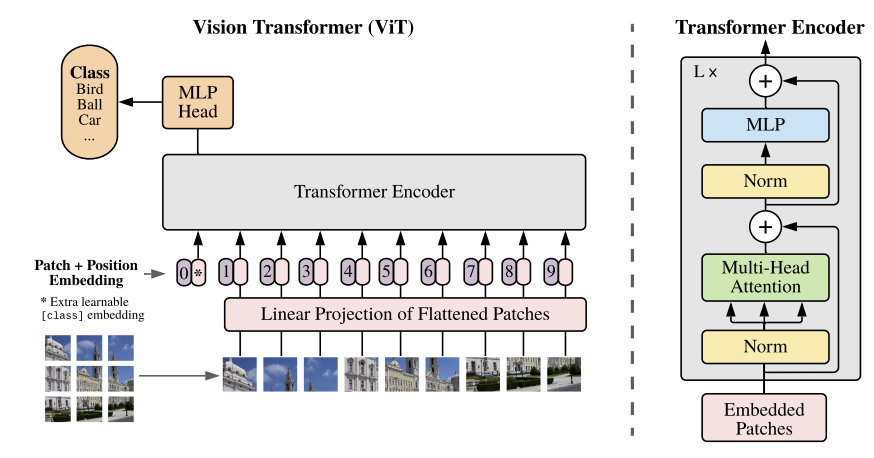
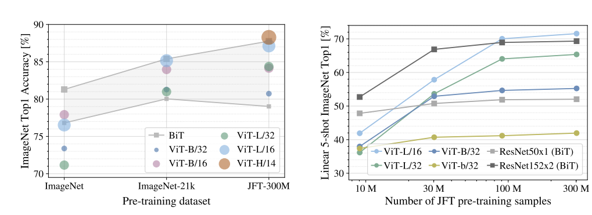

# Vision Transformer (ViT): Transformer for Image Recognition at Scale

[Paper](https://arxiv.org/abs/2010.11929) | [Code](TODO) | [Hugging Face](https://huggingface.co/docs/transformers/en/model_doc/vit)

## Introduction

The Vision Transformer (ViT) is a deep learning model that adapts the Transformer architecture to image recognition tasks. This work demonstrated that, given enough data and model capacity, pure Transformer models can outperform state-of-the-art convolutional neural networks (CNNs) on image classification benchmarks, often with reduced computational cost.

While Transformers have become the standard in NLP due to their efficiency and scalability, CNNs have remained dominant in computer vision. Previous attempts to use attention mechanisms in vision were limited by hardware inefficiencies and the complexity of specialized attention methods.

ViT introduces a simple yet effective approach. It splits an image into fixed-size patches, linearly embeds each patch, and treats these embeddings as input tokens to a standard Transformer. Unlike CNNs, Transformers lack certain inductive biases such as translation equivariance and locality, making them less effective on small datasets. However, when trained on large-scale datasets, ViT achieves state-of-the-art performance in vision tasks.

---

## Related Work

Applying self-attention directly to images is computationally expensive, as each pixel would attend to every other pixel, resulting in quadratic complexity. To address this, prior works have proposed approximations, such as restricting attention to local neighborhoods (Parmar et al., 2018) or using sparse attention patterns (Child et al., 2019). While effective, these methods often require complex implementations to run efficiently on modern hardware.

Hybrid models that combine CNNs for feature extraction with Transformers have also been explored. However, ViT was the first to show that a pure Transformer, when trained on sufficiently large datasets, can match or surpass CNNs in vision tasks.

---

## Methodology

<figure markdown="span">
    
</figure>

### Model

ViT processes an input image $x \in \mathbb{R} ^{H \times W \times C}$ by dividing it into fixed-size patches (e.g., 16x16 pixels). Each patch $x_p \in \mathbb{R}^{N \times (P^2 . C)}$ is then flattened and linearly projected into a lower-dimensional embedding. These patch embeddings are combined with learnable positional encodings and fed into a standard Transformer encoder. A special [class] token is added to the beginning of the sequence, and its final embedding is used for classification. An MLP head is attached to the output of the last layer of the class token.

**Hybrid Architecture**: An alternative approach involves using a CNN to extract image features, which are then used as input to the Transformer. 

### Fine-Tuning

During fine-tuning, the pre-trained classification head is replaced with a zero-initialized $D \times K$ feedforward layer. When fine-tuning on larger resolution images, the patch size remains the same, but the number of patches increases. This change renders the learned positional embeddings incompatible with the new input size. To resolve this, the positional embeddings are resized using 2D interpolation.

---
## Experiments

### Dataset

ViT was trained on:

- **ImageNet-1k:** 1.3M images, 1,000 classes.
- **ImageNet-21k:** 14M images, 21,000 classes.
- **JFT-300M:** 300M images, 18,000 classes (internal Google dataset).

And evaluated on ImageNet, ImageNet-Real, CIFAR-10/100, Oxford Pets, and Oxford Flowers.

### Model Variants
Three main variants of ViT were explored:

- **ViT-Base:** 12 layers, 768 hidden size, 12 attention heads, 86M parameters.
- **ViT-Large:** 24 layers, 1024 hidden size, 16 attention heads, 307M parameters.
- **ViT-Huge:** 32 layers, 1280 hidden size, 16 attention heads, 632M parameters.

### Results

The ViT-L model underperformed on ImageNet-1k compared to ViT-base, even with regularization. However, with pretraining on ImageNet-21k, their performances were comparable. 
The ViT-L/16 model, pretrained on JFT-300M, outperformed BiT-l across all tasks while using fewer computational resources. The advantage of larger models was only evident in the JFT-300M dataset. 

These results indicate that while CNNs have useful inductive biases for small datasets, ViT can surpass CNNs on large datasets by effectively learning patterns directly from the data.

### Scaling
A comparison of model performance versus pre-training cost was conducted for ResNets and ViT models. Notably, ViT requires 2-4 times less computational resources to achieve similar performance as ResNets. Furthermore, ViTs do not appear to reach a performance saturation point within the currently explored range of model sizes, implying that even larger models could deliver superior performance.

### Axial Attention
TODO
<!-- TODO -->

## Limitations and Future Directions

- Is it possible to use denoising objectives for pre-training ViT models?
- ViT has only been evaluated on image classification tasks. However, it might be adaptable to other vision tasks like object detection and segmentation.
- Could multitask learning be beneficial? Is it feasible to train ViT on multiple vision tasks simultaneously, akin to GPT-2 in NLP?
- Like BERT, could directional information be useful for image tasks?
