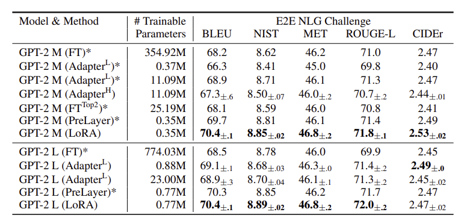

# LoRA: Low-Rank Adaptation

[Paper](https://arxiv.org/abs/2106.09685) | [Code](TODO) | [Hugging Face](https://huggingface.co/learn/llm-course/en/chapter11/4)

## Introduction

Pre-training large-scale language models and adapting them to various downstream tasks has become standard practice. Typically, this adaptation is done through fine-tuning, which updates all parameters of the pre-trained model. However, for models with billions of parameters, this process is computationally expensive and memory-intensive.

Several methods have been proposed to address these challenges, such as updating only a subset of parameters or adding external modules for new tasks. However, these approaches often introduce inference latency (e.g., adapters), reduce usable sequence length (e.g., prefix-tuning), or underperform compared to full fine-tuning.

**Low-Rank Adaptation (LoRA)** is a parameter-efficient fine-tuning technique that overcomes these limitations. LoRA introduces trainable low-rank matrices into existing model weights, significantly reducing the number of trainable parameters while maintaining—or even improving—performance.

The main advantages of LoRA are:

- **Parameter Efficiency:** LoRA reduces the number of trainable parameters, making training more efficient and accessible.
- **Modularity:** Task-specific adapters can be swapped in and out without modifying the base model.
- **Inference Efficiency:** LoRA does not add computation during inference, avoiding the latency issues of adapter layers.

---
## Motivation

Given a pre-trained autoregressive language model $P_{\Phi}(y|x)$, adapting it to new tasks typically means updating the pre-trained weights $\Phi_0$ to $\Phi_0 + \Delta \Phi$ by maximizing the conditional language modeling objective:

$$
\max_{\Phi} \sum_{(x,y)} \sum_{t=1}^{|y|} \log(P_{\Phi}(y_t | x, y_{< t}))
$$

For large models, the number of parameters in $\Delta \Phi$ is as large as in $\Phi_0$, making storage and training impractical.

LoRA addresses this by expressing the task-specific parameter update $\Delta \Phi$ using a much smaller set of parameters $\Theta$, such that $\Delta \Phi = \Delta \Phi(\Theta)$. The optimization then becomes:

$$
\max_{\Theta} \sum_{(x,y)} \sum_{t=1}^{|y|} \log(P_{\Phi_0 + \Delta \Phi(\Theta)}(y_t | x, y_{< t}))
$$

### Previous Solutions

- **Adapter Layers:** Introduced by Houlsby et al., these add two adapter layers per Transformer block. Lin et al. proposed using one adapter layer per block with an additional LayerNorm. While these methods reduce the number of trainable parameters, they increase computational load during inference. Although adapter layers have relatively few parameters, their sequential processing can hinder latency, especially in large neural networks that rely on parallelism.
  
- **Prefix Tuning:** This method reduces the sequence length available for processing downstream tasks, which can be limiting.

---
## Methodology

LoRA modifies the standard fine-tuning process by decomposing the weight updates into low-rank matrices. Instead of updating the full weight matrix $W_0$ in a neural network layer, LoRA freezes $W_0$ and adds a trainable low-rank update:

$$
W = W_0 + \Delta W
$$

where $\Delta W$ is parameterized as the product of two smaller matrices:

$$
\Delta W = BA
$$

- $W \in \mathbb{R}^{d \times k}$ 
- $B \in \mathbb{R}^{d \times r}$
- $A \in \mathbb{R}^{r \times k}$
- $r \ll \min(d, k)$ 

This means only $A$ and $B$ are trained, while $W_0$ remains fixed. The total number of trainable parameters is reduced from $dk$ to $r(d + k)$ per layer. A is initialized with a random Gaussian distribution and B with zero.

The forward pass now becomes: $h = W_0x + \Delta Wx = W_0x + BAx$

**Generalization of Full Fine Tuning:** As we increase the number of trainable parameters, training LoRA roughly converges to training the original model. 

### Application to Transformers

In the Transformer architecture, there are four matrices ($W_1, W_k, W_v, W_o$) in the attention layer and two in the MLP layer. This implementation applies LoRA only to the attention weights, freezing the MLP layer for downstream tasks. 

---
## Experiments and Results

### Baselines

- **Fine-Tuning (FT):** The model is initialized with pre-training weights, and all parameters are updated through gradient descent.
- **Bias-only (BitFit):** Only the bias vectors are trained, with all other parameters frozen.
- **Prefix-embedding tuning (PreEmbed):** Special trainable tokens are inserted among the input tokens, impacting performance based on their placement. The number of trainable parameters is $|\Theta| = d_{model} \times (l_p + l_i)$, where $l_p$ and $l_i$ are the numbers of prefix and infix tokens, respectively.
- **Prefix-layer tuning (PreLayer):** An extension of PreEmbed that learns the activations after every layer, with $|\Theta| = L \times d_{model} \times (l_p + l_i)$.
- **Adapter tuning (Adpt):** Two types of adapter layers are tested: Adapter $^H$, which inserts adapter layers between the self-attention and MLP layers with a subsequent residual connection, and Adapter $^L$, which adds an adapter layer only after the MLP layer and a LayerNorm. The number of trainable parameters is $|\Theta| = \hat{L}_{Adpt} \times (2 \times d_{model} \times r + r + d_{model}) + 2 \times \hat{L}_{LN} \times d_{model}$.
- **LoRA:** Applies LoRA only to $W_q$ and $W_v$, with $|\Theta| = 2 \times \hat{L}_{LoRA} \times d_{model} \times r$.

Experiments conducted on RoBERTA, GPT-2, and GPT-3 models demonstrate that LoRA matches or outperforms the baseline fine-tuning methods while requiring the fewest trainable parameters.

<figure markdown="span">
    
</figure>

---
## Understanding Low-Rank Updates

The low-rank structure of LoRA not only reduces hardware requirements but also provides better interpretability regarding how the updated weights correlate with the pre-trained weights. 

### Which Weights to Update?

Given a fixed computational budget, which weight matrices should be updated to maximize the performance on downstream tasks? Experiments on GPT-3 175B with $r=8$ adapting one type of attention weight, or $r=4$ adapting two types for all 96 layers, provide insights. Adapting only one type of weight resulted in lower performance than adapting two types. This indicates that even a rank-four representation can capture sufficient information in $\Delta W$, making it preferable to adapt more weights rather than increasing the rank of a single type.

### Optimal Rank

The impact of different ranks $r$ was tested by adapting {$W_r, W_v$}, {W_q, W_k, W_v, W_o}, and $W_q$. Results showed that LoRA performs competitively even with a very small $r$, suggesting that the update matrix $\Delta W$ might have a small intrinsic rank. 

To further validate this, the authors examined the overlap of the subspaces learned with different choices of $r$. Given $A_{r=8}$ and $A_r={64}$ which are learned adaptation matrices with r=8 and 64. By performing SVD we get $U_{r=8}$ and $U_{r=64}$. The normalized subspace similarity using Grassmann distance gives how much of the subspace spanned by the top i singular vectors of $A_{r=8}$ is contained in the subspace spanned by the top j singular vectors of $A_{r=64}$.

$$\phi(A_{r=8}, A_{r=64}, i, j) = \frac{||U_{r=8}^{iT} U_{r=64}^{j}||_F^2}{\min(i, j)} \in [0, 1]$$

The results show that the top singular vector overlap significantly while other do not. This explains why r=1 performs quite well on downstream tasks for GPT-3.

### Correlation between $\Delta W$ and $W$

<!-- ## Advantages of LoRA

- **Parameter Efficiency:** Only a small number of parameters are trained, reducing memory and storage requirements.
- **Modularity:** Task-specific adapters can be swapped in and out without modifying the base model.
- **Scalability:** Enables fine-tuning of very large models on modest hardware.
- **Performance:** Empirical results show that LoRA can match or even surpass full fine-tuning in many tasks.
- **Compatibility:** Can be combined with other parameter-efficient methods (e.g., adapters, prompt tuning).

## Limitations

- **Expressivity:** The low-rank constraint may limit the expressiveness of the adaptation for some tasks.
- **Hyperparameter Sensitivity:** The choice of rank $r$ and placement of LoRA modules can affect performance.
- **Not Always Optimal:** For some tasks, full fine-tuning or other adaptation methods may outperform LoRA.

## Applications

- **Natural Language Processing:** LoRA is widely used for adapting large language models (e.g., GPT, BERT) to downstream tasks.
- **Computer Vision:** Applied to vision transformers and other deep models.
- **Multi-task Learning:** Efficiently maintains multiple task-specific adapters for a single base model.
- **On-Device Inference:** Enables deployment of personalized models on edge devices with limited resources. -->

