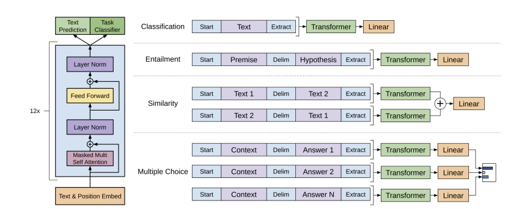
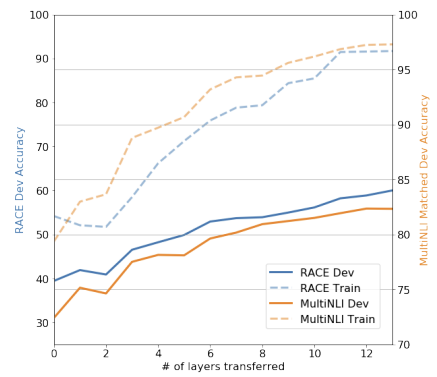

# Improving Language Understanding with Generative Pre-Training

[Paper](https://cdn.openai.com/research-covers/language-unsupervised/language_understanding_paper.pdf) | [OpenAI Blog](https://openai.com/index/language-unsupervised/) | [Code]()

## Introduction

Deep learning models typically require large amounts of labeled data, which limits their use in domains where annotated data is scarce. Models that can learn from unlabeled data offer a promising alternative. Even when labeled data is available, leveraging unlabeled data to learn better representations can significantly boost performance.

However, learning representations beyond the word level presents two main challenges:

1. **Learning Objective**: The optimal objectives for learning transferable representations are not well understood.
2. **Transfer Mechanism**: The best way to transfer these learned representations to downstream tasks remains unclear. Existing methods often require task-specific architectures or auxiliary learning objectives.

GPT-1 addresses these challenges with a semi-supervised approach, using a two-stage training process:

- **Unsupervised Pre-Training**: The model is first trained on large amounts of unlabeled text using a language modeling objective. This helps it learn general language representations.
- **Supervised Fine-Tuning**: The pre-trained model is then fine-tuned on specific tasks using labeled data, adapting its parameters to the target task.

GPT-1 is built on the Transformer architecture, specifically using the decoder (left-to-right) for language modeling. For downstream tasks, it adapts the input format to process structured text as a single sequence of tokens, enabling the model to handle various NLP tasks without changing its core architecture.

---
## Framework

GPT-1's framework consists of two main stages:

### 1. Unsupervised Pre-training
The first stage involves learning a high-capacity language model from a large corpus of unlabeled text.

**Objective**: Learn a general-purpose language model by predicting the next word in a sentence (language modeling objective).

$$L_1(\mathcal{U}) = \sum_i \log P(u_i | u_{i-k}, \cdots, u_{i-1}; \Theta)$$

where $\mathcal{U}$ is the unlabeled corpus, $u_i$ is the $i^{th}$ word, and $\Theta$ are the model parameters.

The Transformer decoder is used for the language model.

$$ \begin{align*}
h_0 &= UW_e + W_p \\
h_l &= transformer\_block(h_{l-1}) \\
p(u) &= softmax(h_nW_e^T)
\end{align*} $$

### 2. Supervised Fine-tuning

**Objective**: Adapt the pre-trained model to specific NLP tasks (e.g., classification, entailment, question answering) using labeled datasets.

$$L_2(\mathcal{C}) = \sum_{(x, y)} log P(y | x^1, \cdots, x^m)$$

where $\mathcal{C}$ is the labeled dataset.

The inputs are passed through the pre-trained model to get the final transformer's block activations $h_l^m$, which are then fed into the linear output layer to produce task-specific predictions.

$$ P(y | x^1, \cdots, x^m) = softmax(h_l^mW_y)$$

Additionally, the authors found that including an auxiliary language modeling objective during fine-tuning helped improve generalization and accelerate convergence.

$$L_3(\mathcal{C}) = L_2(\mathcal{C}) + \lambda L_1(\mathcal{C})$$

where $\lambda$ is a hyperparameter controlling the weight of the auxiliary language modeling loss.

---
### Task-Specific Input Transformations

Since the model is trained on a single contiguous sequence of tokens, it requires task-specific input transformations to handle structured text inputs. These input transformations allow the use of a single model for multiple tasks, avoiding the need for task-specific architectures. The transformations include:

- Textual Entailment: Concatenating premise and hypothesis with a delimiter token $ between them.
- Similarity: Two sentences are concatenated with a delimiter token between them. Both possible sentence orderings are processed independently. They are then added element-wise before passing into the linear output layer.
- Q&A: Given a document z, a question q, and a set of possible answers $a_k$. The document and question are concatenated with each possible answer $a_k$ with a delimiter token. Each sequence is processed independently and normalized via a softmax layer to produce a probability distribution over the possible answers.

---
## Experiments

Pre-training was performed on the BooksCorpus dataset, which contains over 7,000 unpublished books.

**Model Specs**: A 12-layer Transformer decoder with 768 hidden units and 12 attention heads, resulting in 117M parameters. For position-wise feed-forward, 3072 hidden states were used.
Adam optimizer with a max learning rate of 2.5e-4 and a batch size of 64 was used for pre-training. The model was trained for 100 epochs. A simple weight initialization of $N(0, 0.02$ is used.
Dropout with a rate of 0.1 was used for regularization. For activation, GELU was used. Learned positional embeddings were used instead of fixed sinusoidal embeddings.

**Fine-tuning details**: Learning rate was set to 6.25e-5, and the model was fine-tuned for 3 epochs on each task.

GPT-1 was evaluated on several benchmark NLP tasks, including: Natural Language Inference (SNLI, MNLI, QNLI, SciTail & RTE), Question Answering (RACE & Story Cloze), Semantic Similarity (MRPC, QQP & STS-B) and classification (CoLA & SST-2).

---
## Analysis

**Impact of number of layers transferred**: Each layer in the pre-trained model captures useful functionality for target tasks. The authors found that transferring all layers of the pre-trained model to the target task yields better performance up to 9% on MultiNLI.

## Ablations

Ablation studies in the GPT-1 paper examined the impact of:

- **Auxiliary LM during fine-tuning**: The auxiliary objective helps on the NLI task and QQP. Overall, it's beneficial for larger datasets.
- **Transformer VS LSTM**: LSTM shows a score drop of 5.6 on average.
- **Supervised vs Semi-supervised**: Lack of pre-training hurts performance across all tasks.

