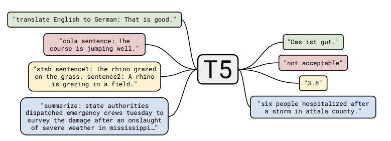
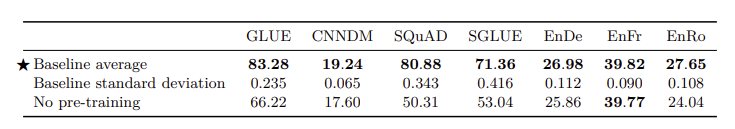
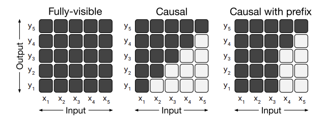

# T5: Exploring the Limits of Transfer Learning with a Unified Text-To-Text Transformer

[Paper](https://arxiv.org/abs/1910.10683) | [Code](TODO) | [Hugging Face](https://huggingface.co/docs/transformers/model_doc/t5)

## Introduction

This paper provides a comprehensive overview of the current state of transfer learning in NLP, rather than introducing a new model. It surveys, explores, and empirically compares existing techniques—including training objectives, architectures, and datasets—to investigate the boundaries of current approaches.

[//]: # (Training machine learning models for NLP tasks often requires the model to process text in a way that is useful for downstream applications. This involves developing general-purpose knowledge that enables the model to understand language, ranging from low-level syntax to high-level semantics. Such knowledge is rarely provided explicitly; instead, it is typically acquired through auxiliary tasks. For example, word vectors are learned by encouraging words that appear together to be close in a continuous space, capturing semantic relationships.)

Unsupervised pre-training on large, diverse text corpora has become increasingly common and has achieved state-of-the-art results on many NLP benchmarks. The abundance of text data on the internet, combined with the scalability of neural networks, made unsupervised learning a promising direction for NLP research.

As a result, there has been significant progress in transfer learning for NLP, leading to a variety of pre-training objectives, fine-tuning methods, benchmarks, and datasets. To systematically study these approaches, this paper introduces a unified framework for transfer learning.

In this framework, every NLP problem is cast as a text-to-text task, where both inputs and outputs are text strings. This enables the use of a single model architecture and training objective across a wide range of tasks.

## Setup

### Model

The model architecture is almost identical to the original Transformer architecture, with a few modifications - removing the Layer Norm bias, placing the layer norm outside the residual connections, and using a relative position embeddings.

### Data and Pretraining

Common Crawl a publicly available web archive, is used as the primary source of data for pre-training. The authors filter the data to remove low-quality text and ensure a diverse set of topics. The dataset is tokenized using a SentencePiece model, which allows for efficient handling of rare words and subword units. The cleaned dataset is named C4 (Colossal Clean Crawled Corpus).

### Downstream Tasks

T5 is evaluated on a variety of NLP tasks, including:

- Text classification benchmarks (GLUE and SuperGLUE)
- Summarization (CNN/Daily Mail)
- Question answering (SQuAD)
- Machine translation (WMT English to German, French, and Romanian)

### Unified Input and Output Format

To enable a single model to handle diverse tasks, all tasks are reformulated as text-to-text problems. This means both inputs and outputs are always text strings, regardless of the task. For example:

- **Translation:**  
  Input: `translate English to German: That is good.`  
  Output: `Das ist gut.`
- **MNLI (Natural Language Inference):**  
  Input: `mnli premise: I hate pigeons. hypothesis: My feelings towards pigeons are filled with animosity.`  
  Output: `entailment`

The specific text prefix used for each task is a hyperparameter, but the authors found that the exact wording has little impact on performance.

## Experiments and Results

A baseline metrics is established for all the benchmarks. This baseline is compared against altering one aspect of the model at a time, such as the pre-training objective, architecture, or dataset. This approach allows for a clear comparison of how each factor impacts performance.

### Baseline

The baseline model is a standard Transformer, pre-trained using a denoising (masked language modeling) objective on the C4 dataset. After pre-training, the model is fine-tuned separately for each downstream task.

**Architecture:**
 
- Encoder: 12 layers
- Decoder: 12 layers
- Hidden size ($d_{model}$): 768
- Attention heads: 12
- Feed-forward inner dimension ($d_{ff}$): 3072
- Total parameters: 220 million

**Pre-training:**

- Steps: $2^{19}$ (524,288 steps)
- Batch size: 128
- Max sequence length: 512
- Multiple sequences are packed per batch to reach roughly $2^{16}$ tokens per batch
- Total tokens seen: $2^{35}$ (a fraction of the C4 dataset)

**Fine-tuning:**

  - Steps: $2^{18}$
  - Checkpoints saved every 5,000 steps
  - Best checkpoint selected based on validation loss

<figure markdown="span">
    
</figure>

### Architecture Comparison

A major distinguishing factor for different architectures is the "mask" used by different attention mechanisms. The paper compares the following architectures:

- **Encoder-Decoder:** The encoder uses a fully-visible attention mask (all tokens can attend to each other), while the decoder uses a causal mask (each token can only attend to previous tokens).
- **Language Model (Decoder-only):** Uses a causal mask throughout, so each token only attends to earlier tokens in the sequence.
- **Prefix Language Model (Prefix LM):** Applies a fully-visible mask to the prefix portion of the input, and a causal mask to the remainder.

To ensure a fair comparison, the paper matches models by parameter count or computational cost. All three architectures—encoder-decoder, language model, and prefix LM—are pre-trained using both language modeling and denoising objectives.

**Key findings:**

- The encoder-decoder architecture with a denoising objective achieves the best performance.
- Sharing parameters between the encoder and decoder yields similar results to the standard encoder-decoder, but with fewer parameters.

### Pre-training Objectives Comparison

The paper compares different pre-training objectives, including:

- **Language Modeling:** Trains the model to predict the next token in a sequence, similar to traditional language models.
- **Bert-style MLM:** Randomly masks out 15% of the input tokens and trains the model to predict the masked tokens.
- **MASS-style:** MLM without random token replacement.
- **Deshuffling**: Randomly shuffles the input tokens and trains the model to predict the original order.
- **I.i.d noise, span mask:** Randomly selects spans of text to mask.

**Findings:**

- The BERT-style MLM objective outperforms standard language modeling.
- Among BERT-style variants, span corruption (masking contiguous spans) achieves similar performance to standard MLM but enables faster training due to shorter target sequences.

### Datasets Comparison

The main finding is that pre-training on in-domain, unlabeled data can significantly improve results on downstream tasks.

For example, pre-training on a combination of Wikipedia and the TBC corpus led to better performance on the SuperGLUE benchmark compared to using only the C4 dataset. This improvement was largely due to the MultiRC task in SuperGLUE, which is primarily sourced from the TBC corpus. 

### Fine-tuning Methods Comparison

The paper compares different fine-tuning methods, including:

- **Standard Fine-tuning:** The entire model is fine-tuned on the target task, updating all parameters.
- **Adapter Fine-tuning:** Small adapter modules (additional dense-ReLU-dense layers) are inserted after each feed-forward layer in the Transformer. Only these adapters are trained, while the rest of the model remains frozen.
- **Gradual Unfreezing:** Model layers are unfrozen one at a time during fine-tuning, starting from the last layer and moving backward. A new layer is unfrozen every $2^{18} / 12$ steps.

**Findings:**

- Fine-tuning all parameters generally yields the best results.
- Adapter fine-tuning achieves comparable performance with far fewer trainable parameters, making it efficient for resource-constrained scenarios.

### Multi-task Learning

The paper also investigates multi-task learning, where the model is pre-trained on multiple tasks simultaneously. This approach encourages the model to learn representations that are useful across different tasks. During evaluation, the best checkpoint for each task is selected. Various task-specific data distributions are tested.

**Findings:**

- Multi-task pre-training typically underperforms compared to pre-training and fine-tuning on individual tasks.

### Scaling Comparison

The study compares the baseline model to larger models (4x size), longer training (4x steps), a combination of both (2x size & 2x steps), and ensembles (4x models).

**Findings:**

- Increasing model size and/or training steps consistently improves performance.
- Combining larger models with longer training yields complementary gains.
