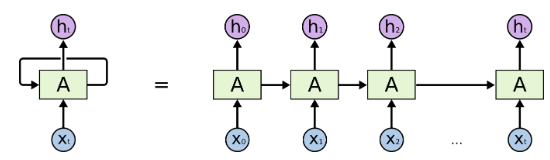
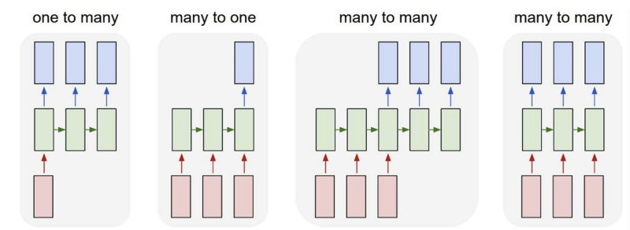

# RNN

[Code](https://github.com/saikrishnaponnam/Machine-Learning/blob/main/src/layers/rnn.py)

Traditional models like logistic regression and multilayer perceptrons (MLPs) expect each input $x_i$ to be a fixed-size vector in $\mathbb{R}^d$. These are typically called tabular datasets.

Image data, for example, is structured as a grid of pixels and represented as a 2D matrix. 
Convolutional Neural Networks (CNNs) are designed to process this spatial structure. 
However, both tabular and image data are of fixed length.But what if our data is not fixed in length? Examples include a sequence of images in a video or a sequence of words in language tasks like image captioning or translation.

Recurrent Neural Networks (RNNs) are specialized for handling sequential data, where the input length can vary. 
RNNs use recurrent connections to capture the dynamics of sequences, allowing them to maintain a memory of previous inputs.

## Working with Sequences
A sequence is an ordered list of feature vectors $x_1, \dots, x_T$, where each $x_t \in \mathbb{R}^d$ and $t$ is the time step.

While individual inputs are typically assumed to be independently sampled from a distribution $P(X)$, in sequential data, we cannot assume that each time step is independent of the previous ones.

Given a sequential input, the goal may be to predict a single output $y$ or sequentially structured output ($y_1, \dots, y_T$).

## RNNs
An RNN processes sequential input one step at a time, maintaining a hidden state that serves as memory.
Let's denote:

- $x_t \in \mathbb{R}^d$: input at time step $t$
- $h_t \in \mathbb{R}^d$: hidden state at time step $t$
- $y_t \in \mathbb{R}^m$: output at time step $t$
- $W_{xh}$: weight matrix from input to hidden state
- $W_{hh}$: weight matrix from hidden state to hidden state
- $W_{hy}$: weight matrix from hidden state to output
- $\phi$: activation function

The hidden state $h_t$ at time step $t$ is computed from the previous hidden state $h_{t-1}$ and the current input $x_t$.
This hidden state stores information about the sequence up to that point.
Unlike traditional deep neural networks, RNNs share the same parameters across all time steps.

<figure markdown="span">
    
    <figcaption>RNN unrolled</figcaption>
</figure>

$$\begin{align*} 
a_t &= W_{xh} x_t + W_{hh} h_{t-1} + b_h \\
h_t &= \phi(a_t)\\
y_t &= W_{hy} h_t + b_y \end{align*}$$

Not all RNNs produce output at every time step; some only output at the final time step. 
The key feature of an RNN is its hidden state, which captures information about the sequence.

## Training RNNs

Training RNNs is similar to training other neural networks, but with some additional considerations due to the sequential nature of the data.
### Loss Function
The loss function for RNNs can be defined as the sum of the losses at each time step, or as the average loss across all time steps.

$$L = \frac{1}{T} \sum_{t=1}^{T} l(y_t, \hat{y}_t)$$

where $L$ is the loss function (e.g., cross-entropy loss), $y_t$ is the true output at time step $t$, and $\hat{y}_t$ is the predicted output at time step $t$.

## Backpropagation through time (BPTT)
When training RNNs, we often use backpropagation through time (BPTT) to compute gradients.
BPTT is an extension of backpropagation that allows us to compute gradients for sequences by unrolling the RNN through time, one step at a time.
The unrolled RNN is treated as a feedforward network, where each time step corresponds to a layer in the network.
But same parameters are shared across all time steps/layers. The gradients are computed for each time step and then accumulated to update the parameters.

Let $\delta_y^t = \frac{\partial L_t}{\partial \hat{y}_t}$, $\delta_h^t = \frac{\partial L_t}{\partial h_t}$, $\delta_a^t = \delta_h^t * \phi'(a_t) $, where $\phi'(a_t)$ is the derivative of the activation function element-wise.

### Gradients w.r.t output weights

$$\begin{align*}
\frac{\partial L}{\partial  W_{hy}} &= \sum_t \frac{\partial l}{\partial W_{hy}} \\
\frac{\partial l}{\partial W_{hy}} &= \frac{\partial l}{\partial \hat{y}_t} \cdot \frac{\partial \hat{y}_t}{\partial w_{hy}} = \delta_y^t . (h_t)^T \\
\frac{\partial L}{\partial W_{hy}} &= \sum_t {\delta_y^t} \cdot (h_t)^T \\
\end{align*}$$

### Gradients w.r.t input weights
To update the input-to-hidden weights $W_{xh}$, we compute the gradient of the loss with respect to $W_{xh}$ by accumulating contributions from all time steps:

$$
\frac{\partial L}{\partial  W_{xh}} = \sum_t \frac{\partial l}{\partial  a_t} \cdot \frac{\partial a_t}{\partial  W_{xh}} = \sum_t \frac{\partial l}{\partial  a_t} \cdot (x_t)^T 
$$

$$\begin{align*}
\frac{\partial l}{\partial  a_t} &= \frac{\partial l}{\partial h_t} \frac{\partial h_t}{\partial a_t} = \frac{\partial l}{\partial h_t} * \phi'(a_t) \\ 
\frac{\partial l}{\partial  h_t} &= \frac{\partial l}{\partial h_t} + \frac{\partial l}{\partial h_{t+1}} \frac{\partial h_{t+1}}{\partial h_t} \\
\frac{\partial l}{\partial  h_t} &= \frac{\partial l}{\partial h_t} + \frac{\partial l}{\partial h_{t+1}} * \phi(a_{t+1}) \cdot W_{hh}^T \\
\frac{\partial l}{\partial a_t} &= \delta_h^t * \phi'(a_t) \\
\text{where } \delta_h^t &= \frac{\partial l}{\partial h_t} + \delta_h^{t+1} * \phi'(a_{t+1}) \cdot (w_{hh})^T = \frac{\partial l}{\partial h_t} + \frac{\partial l}{\partial a_{t+1}} \cdot (w_{hh})^T   \\
\end{align*}$$

We get $\frac{\partial l}{\partial h_t}$ from the output ($y_t$ - Linear layer) or sometimes directly from loss function.

### Gradients w.r.t recurrent weights

Similar to above

$$\begin{align*}
\frac{\partial l}{\partial  W_{hh}} &= \sum_t \frac{\partial l}{\partial  a_t} \cdot \frac{\partial a_t}{\partial  W_{hh}} \\
\frac{\partial a_t}{\partial  W_{hh}} &= (h_{t-1})^T\\
\frac{\partial l}{\partial w_{hh}} &= \sum_t \delta_h^t * \phi'(a_t) \cdot (h_{t-1})^T \\
\end{align*}$$

### Gradients w.r.t input

$$\begin{align*}
\frac{\partial L}{\partial  x_t} &= \sum_{t} \frac{\partial l}{\partial  a_t} \cdot \frac{\partial a_t}{\partial x_t} \\
\frac{\partial L}{\partial  x_t} &= \sum_{t} \frac{\partial l}{\partial  a_t} \cdot (W_{xh})^T \\
\end{align*}$$

### Vanishing and Exploding Gradients
Although RNNs are theoretically capable of utilizing information from sequences of any length, in practice they are constrained to remembering only a limited number of previous steps. 
This limitation arises because RNNs often experience vanishing or exploding gradients, which makes training on long sequences challenging.
This mainly occurs because $\frac{dL}{dh_t}$ depends on $\frac{\partial h_t}{\partial h_k}$, which itself is a chain of derivatives. 
With small values in the weight matrices and repeated matrix multiplications (especially as \( t-k \) increases), the gradients shrink exponentially, often vanishing after just a few time steps.
As a result, gradient contributions from distant time steps become negligible, and the model fails to learn long-range dependencies.

$$\begin{align*}
\delta_t &= \frac{dl}{dh_t} + \delta_{t+1} \cdot \phi'(a_{t+1}) \cdot W_{hh}^T\\
&= \frac{dl}{dh_t} + (\frac{dl}{dh_{t+1}} + \delta_{t+2} \cdot \phi'(a_{t+2}) \cdot W_{hh}^T ) \cdot \phi'(a_{t+1}) \cdot W_{hh}^T \\
&= \frac{dl}{dh_t} + (\frac{dl}{dh_{t+1}} \cdot \phi'(a_{t+1}) \cdot W_{hh}^T ) + (\frac{dl}{dh_{t+2}} \cdot \phi'(a_{t+2}) \cdot W_{hh}^T \cdot \phi'(a_{t+1}) \cdot W_{hh}^T) + \cdots \\
&= \sum_{k=0}^{T-t} ((\Pi_{j=1}^{k} W_{hh} \cdot \phi'(a_{t+j})) \cdot \frac{dl}{dh_{t+k}})\\
\end{align*}$$

The term $\prod_{i=t-k+1}^{t} W_{hh}^T \cdot \phi'(a_i)$ captures the accumulated effect of the recurrent weights and the activation function's derivative over the previous $k$ time steps.

$\phi$ is typically a non-linear activation function like tanh or ReLU, $||\phi'(a_i)|| = \gamma \le 1$.  
$||\Pi_{i=t-k+1}^t W_{hh} \cdot \phi'(a_i)|| \le (\gamma ||W_{hh}||)^k$  

This leads to two main issues:

1. As $k$ increases, if the weights are small, the gradients can vanish.
2. If the weights are large, the gradients can explode.

## Gradient Clipping
Gradient clipping is a technique used to mitigate exploding gradients by capping the gradients during backpropagation.

## Best Practices
When implementing RNNs, consider the following:

- **Batching**: RNNs can be trained on batches of sequences, but care must be taken to handle variable-length sequences. Padding is often used to ensure that all sequences in a batch have the same length.
- **Regularization**: Techniques like dropout can be applied to RNNs, but they need to be adapted for sequential data. Variants like variational dropout or zoneout are often used.

## Q&A